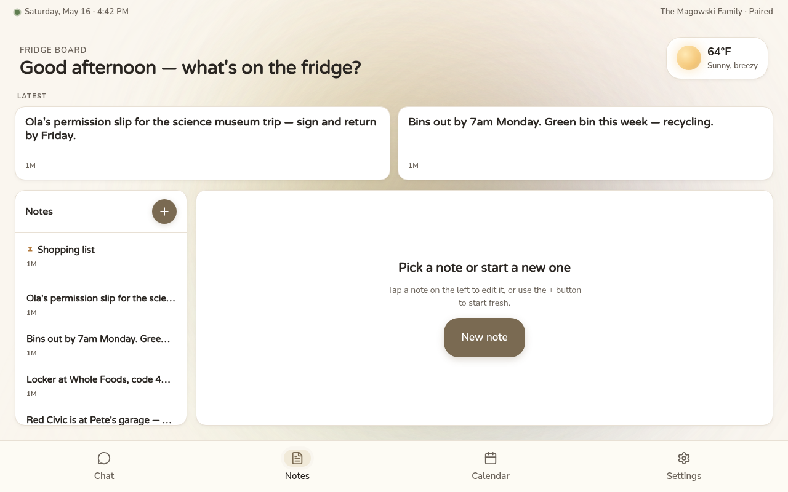
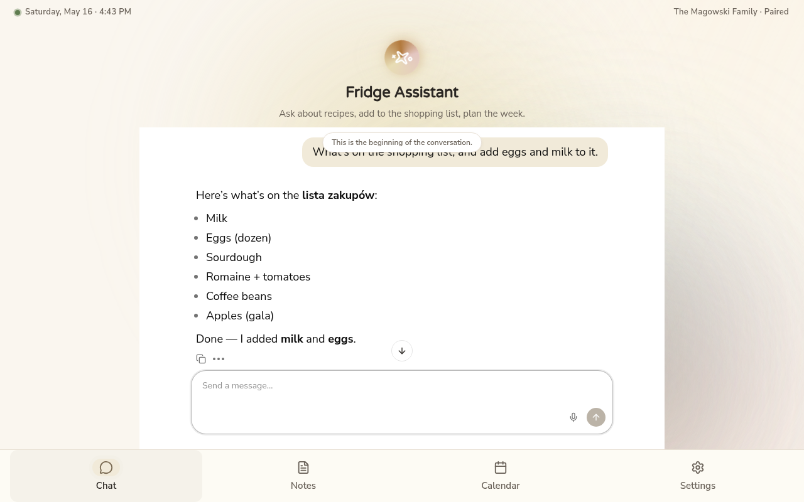
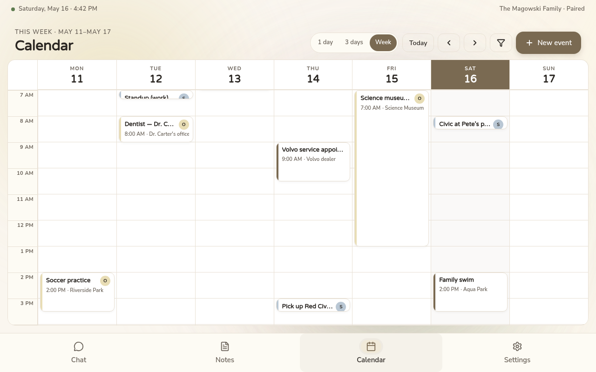
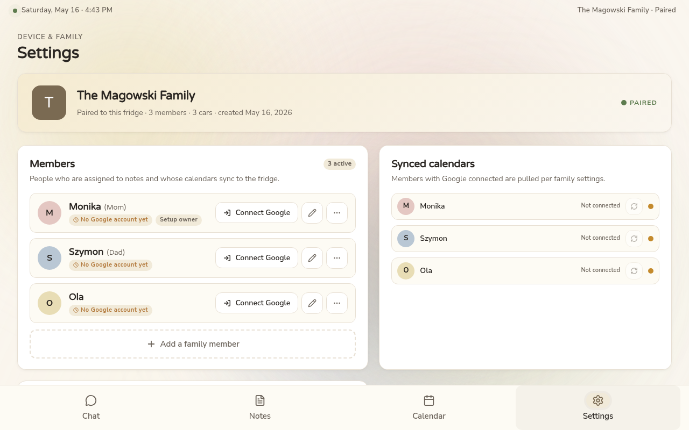
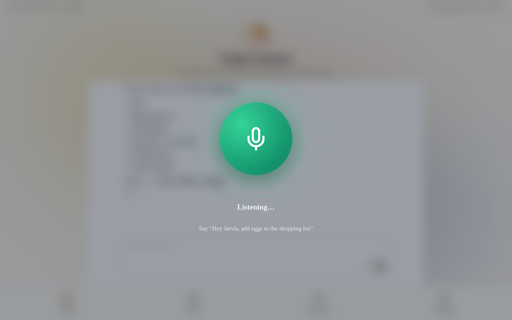
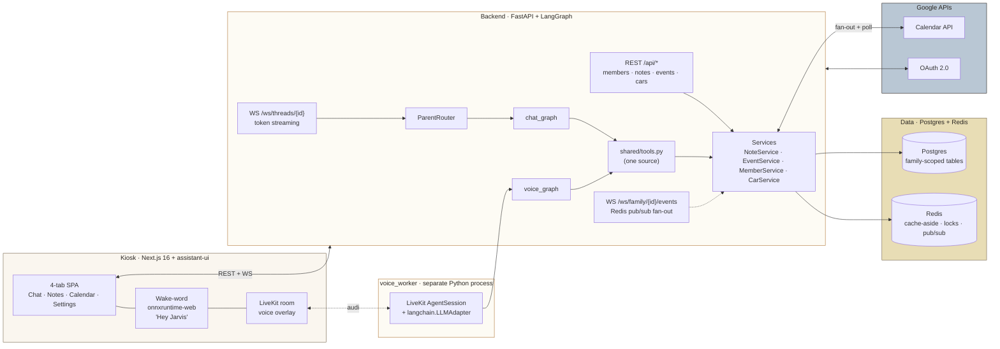
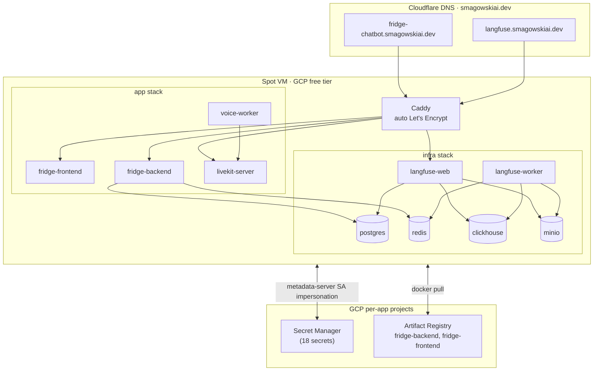

# Family Fridge

> A shared, always-on touchscreen appliance mounted on the family fridge — chat, notes, calendar, and voice control for a whole household. **No per-user login.** A family is the tenant; members are assignees.

<p align="center">
  
</p>

---

## What it is

A landscape 1280×800 kiosk that lives on the kitchen fridge. The same LangGraph assistant answers in two channels:

- **Chat** — typed, markdown-friendly, streamed token-by-token over WebSocket.
- **Voice** — passive wake word *"Hey Jarvis"* → LiveKit room → terse spoken replies. One tool layer, two compiled graphs, channel decided by transport (never by the LLM).

It is shared by an entire household — the device boots straight into the board, no sign-in screen. Onboarding is a one-time Google pairing that mints a device JWT.

---

## Tour

> Screenshots are taken against the real production routes with a seeded family of three (Monika, Szymon, Ola), three cars, a pinned shopping list, six notes, and eleven events across the current week. The data lands via `backend/seed_screenshot_data.py`; no mocks.

| Notes | Chat |
|---|---|
|  |  |
| **Master / detail layout.** Latest pinned notes float to the top of the board; the full list lives in the left rail; tap a note to edit it on the right. Empty selection invites you to start a new one. | **Real tool calls.** The assistant called `list_notes` to read the shopping list, then `add_to_shopping_list` to append items, then summarized — all in one streamed reply. Same tools the voice channel uses. |

| Calendar | Settings |
|---|---|
|  |  |
| **True calendar grid**, not an agenda list. Columns are days; rows are hours from 7 AM to midnight; switch between `1 day` / `3 days` / `Week`. Events render as colored blocks in the assignee's pastel; family-wide events use the neutral stone. | Three members seeded with `blush` / `blue` / `butter` pastel colors. Each has a `Connect Google` button that kicks off OAuth and turns the calendar rail green. The card top-right shows pairing status. |

### Voice channel

<p align="center">
  
</p>

The kiosk listens passively for **"Hey Jarvis"** in the browser — three openWakeWord ONNX models run on `onnxruntime-web` (WASM, ~3.7 MB, no API key, no licence, mic audio never leaves the device). On detection this overlay slides in over the kiosk shell (which stays mounted underneath — you can see the chat conversation faintly through the backdrop blur). LiveKit takes the mic; the `voice_worker` Python process joins the room and pipes audio into the `voice_graph` (same tools as chat, terse spoken prompt). When the agent calls `end_session` the worker publishes `voice_session.ended` to the family-events channel and the overlay closes itself.

In a deployed kiosk the orb runs through `idle → connecting → listening → thinking → speaking` and back to `idle`, all driven by the agent's session events. The screenshot above shows the `listening` state composited over the real production chat view.

---

## How a family uses it

1. **First boot** — phone scans a pairing QR → Google sign-in → device JWT issued → the first family member is created automatically with a pastel color and a connected Google Calendar. The "Shopping list" note is seeded.
2. **Day-to-day** — anyone in the kitchen taps a tab, adds a note, ticks a shopping item, or just says *"Hey Jarvis, add eggs to the shopping list."* Voice replies are ≤ 25 words so they don't trample kitchen conversation.
3. **Calendar fan-out** — when an event is assigned to a member, it's posted to that member's *personal* Google Calendar in the background. Edits propagate the same way. Polling pulls everyone's events back into the board.
4. **Multi-client coherence** — every mutation publishes to a `family:{id}:events` Redis channel; any other open client (phone in another room, second tablet) re-renders without polling.

---

## Architecture



**Key invariants:**

- *One service layer, two transports.* REST and chat WS both call the same `NoteService`/`EventService`. Tools are the third caller.
- *Family-scoping is enforced at the service layer.* Every row carries `family_id`; every query filters by it.
- *Cache-aside + invalidate-on-write* on every hot GET. Redis is heavy — not an optimization, a load-bearing layer.

---

## Stack

| Layer | Choice |
|---|---|
| Frontend | Next.js 16 (App Router, Turbopack) · React 19 · TypeScript · Tailwind 4 · shadcn · `@assistant-ui/react` |
| i18n | Paraglide JS (compile-time, `en` + `pl`, Polish plural rules) |
| Wake word | openWakeWord (`hey_jarvis_v0.1.onnx`) running in-browser via `onnxruntime-web` (WASM) |
| Voice transport | LiveKit (server + client SDK + Python Agents) |
| Backend | FastAPI · Pydantic v2 · SQLAlchemy 2 · Alembic · `asyncio` |
| LLM orchestration | LangGraph 1.x (two compiled `StateGraph`s — chat + voice) |
| Observability | Langfuse v3 (self-hosted) |
| Data | Postgres 16 · Redis 7 |
| Auth | Device JWT (one per kiosk) + Google OAuth for per-member calendar access |
| Deploy | Docker Compose on a single Spot VM behind Caddy (auto-HTTPS via Let's Encrypt) |

---

## Run it locally

You need Python 3.11+ with Poetry, Node.js 24 with pnpm (via Corepack), Postgres 16, and Redis 7. The repo's `.devcontainer/` provisions all of this — open in VS Code / GitHub Codespaces and skip to step 3.

```bash
# 1. Backend env
cd backend
cp .env.example .env       # set OPENAI_API_KEY at minimum
poetry install

# 2. Frontend env
cd ../frontend
cp .env.example .env.local # set NEXT_PUBLIC_BACKEND_URL if not http://localhost:8001
pnpm install

# 3. Start everything together
cd ..
./dev.sh
```

`dev.sh` starts:
- backend at `http://localhost:8001` *(uvicorn — auto-migrates on startup)*
- frontend at `http://localhost:3000`
- voice worker as a third process *(skipped cleanly if `OPENAI_API_KEY` is unset)*

Logs are color-coded. Ctrl+C kills all three.

### Reproduce the screenshots

```bash
# Seed a realistic family + members + notes + 1-week of events, print a device JWT
cd backend && poetry run python seed_screenshot_data.py

# Paste the printed JWT into your browser:
#   localStorage.setItem('fridge-chatbot-token', '<the JWT>')
# Then refresh http://localhost:3000 — the kiosk boots straight into the Notes board.
```

The four tab screenshots above are captured against this seeded state. The voice overlay shot comes from `/design-preview/voice` — a sandboxed route that statically renders the production CSS in the `listening` state, since dev environments don't usually have a LiveKit server running.

### See the UI without the backend at all

```bash
cd frontend && pnpm dev
```

- `http://localhost:3000/design-preview` — sandboxed SPA renders all four tabs with the Designer's mock data. Looks similar but not identical to production — it's the *design contract*, not the shipped UI.
- `http://localhost:3000/design-preview/voice` — static render of the voice overlay.

---

## Production deployment

One VM, one `docker-compose`, fifteen containers:



Deploy is one command from your devcontainer:

```bash
cd deploy && ./deploy.sh
```

It builds + pushes images, copies the three deploy files (`docker-compose.prod.yml`, `Caddyfile`, `fetch-secrets.sh`) to the VM, fetches 18 secrets from Secret Manager, and brings the stack up. Idempotent. See [`deploy/README.md`](deploy/README.md) for the full runbook.

---

## Repository layout

```
backend/        # FastAPI + LangGraph
  src/
    routes/         # 14 HTTP + WS endpoints
    services/       # one service per domain (notes, events, members, cars, calendar, google…)
    llm_graphs/
      graphs/       # chat_graph.py · voice_graph.py
      shared/       # tools.py · prompts.py (channel-parameterized)
    voice_worker/   # separate LiveKit Agents process
    models/         # SQLAlchemy ORM, one file per entity
  alembic/      # migrations
frontend/       # Next.js 16 kiosk SPA
  src/
    app/
      page.tsx              # production kiosk shell (post-pairing)
      design-preview/       # sandboxed mock SPA — screenshots are taken here
      pair/                 # first-boot pairing
    components/fridge/      # tabs, status bar, ambient layer
    lib/
      use-fridge-runtime.ts # custom assistant-ui runtime (REST + WS, no vendor SDK)
      wake-word-pipeline.ts # mel → embedding → hey-jarvis ONNX chain
deploy/         # production compose + Caddy + secret fetcher + deploy.sh
dev.sh          # start backend + frontend + voice worker together
```

---

## License

[Add your license here]
